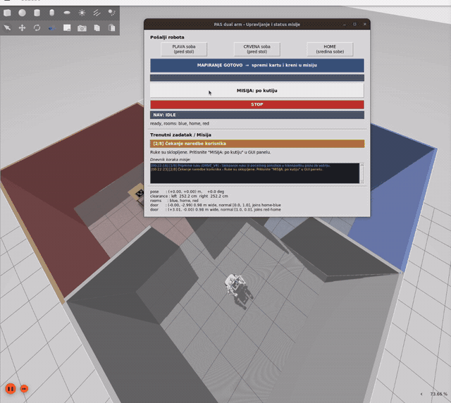
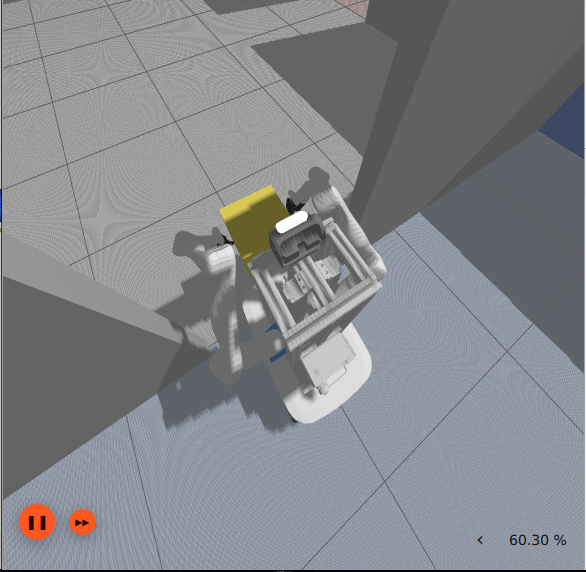
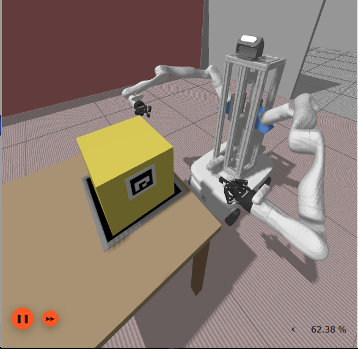
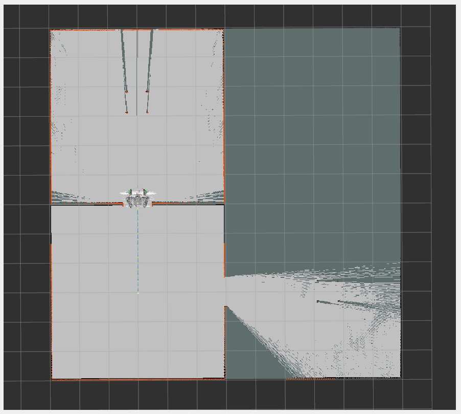
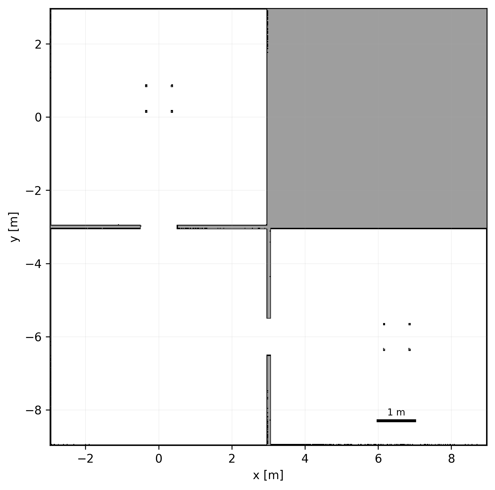
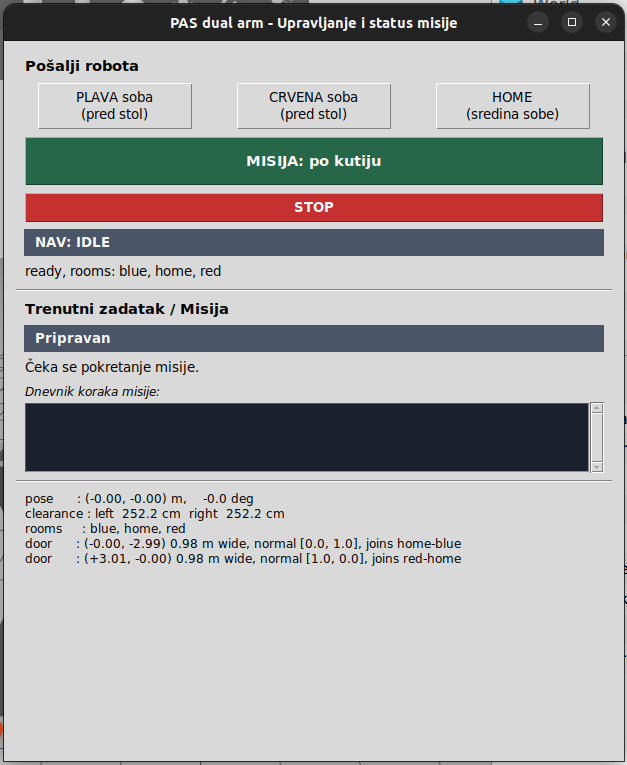
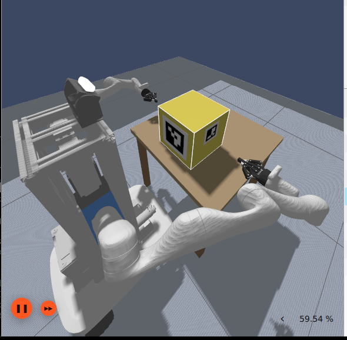

# PAS-DUAL-ARM — dual-arm mobile manipulator simulation (ROS 2 Humble + Gazebo Fortress)

> **Course project — Design of Autonomous Systems**
> Faculty of Mechanical Engineering and Naval Architecture, University of Zagreb
> Authors: **Krešimir Hartl** and **Ivan Noršić**

A mobile robot with **two Kinova Gen3 arms** mounted on **vertical linear rails**, an
**omnidirectional base** and a **pan-tilt camera**. The complete mission runs from **a single
command**:

> the robot waits for a command → drives to the room holding the box → finds it →
> **lifts it with both arms** → carries it through a doorway → **places it on a marked spot**
> in another room.

## The mission, recorded



*The whole mission at 16× speed. Nothing is cut — this is one run from end to end.*

**▶ [Watch the full run at normal speed (6 min, 13 MB)](docs/demo.mp4)** — GitHub does not play an
mp4 stored in a repository inline, so that link downloads it. It is the same run, and it shows
what the animation above crops out: Gazebo on the left, what the robot *believes* on the right —
the map, its own footprint, the laser, the particle cloud and the planned path. The panel between
them is the only input the run takes: one button.

The run ends with the robot's own verdict on screen: *"Kocka je točno na markeru! Odstupanje od
centra: 3 mm"* — the box is on the marker, 3 mm off centre by its own measurement. Measured
independently against the simulator's poses, runs like this one land a median of 8.0 mm off; the
difference between those two numbers is the subject of
[section 9](#9-repeating-the-mission-and-measuring-it).

The stills below are the two moments the video is about — carrying the box through a doorway, and
placing it on the destination marker.

| Carrying the box through a doorway | Placing it on the marker |
|---|---|
|  |  |

**Measured over 40 runs, not once.** The mission finished **40 times out of 40**, and the box was
placed a median of **8.0 mm** from the marker centre — measured against the simulator's own poses,
not against what the robot claimed. The full statistics, and how they
were recorded, are in [section 9](#9-repeating-the-mission-and-measuring-it).

> **The map ships with the repository.** `src/pas_dual_arm_bringup/maps/seminar_map.yaml` is the
> default map and the mission drives on it, so **you do not need to run SLAM to see the demo**.
> That map was produced by running the mapping mode and driving the robot manually; you can
> rebuild it for a different room layout — see [`docs/MAPPING.md`](docs/MAPPING.md).

---

## 1. Requirements

| | |
|---|---|
| OS | Ubuntu 22.04 |
| ROS 2 | Humble |
| Simulator | Gazebo **Fortress** (LTS) + `ros-humble-ros-gz` |
| Other | `python3-vcstool`, `python3-rosdep`, `colcon` |

```bash
sudo apt update
sudo apt install ros-humble-desktop ignition-fortress ros-humble-ros-gz \
                 ros-humble-nav2-bringup ros-humble-slam-toolbox ros-humble-moveit \
                 ros-humble-ros2-control ros-humble-ros2-controllers \
                 ros-humble-teleop-twist-keyboard \
                 ros-humble-omni-base-description ros-humble-pal-urdf-utils \
                 python3-vcstool python3-rosdep python3-colcon-common-extensions
```

## 2. Fetch and install

Five packages under `src/` are **third-party repositories** and are deliberately not part of this
repository. They are fetched straight from their authors at pinned revisions listed in
`ros2.repos` (attribution and licences: [§12](#12-third-party-packages)).

```bash
git clone https://github.com/KxHartl/PAS-DUAL-ARM.git
cd PAS-DUAL-ARM

vcs import src < ros2.repos     # aruco_ros, omni_base_simulation, pan_tilt_ros,
                                # realsense-ros, ros2_kortex — from the authors' GitHub
./scripts/apply_patches.sh      # local patches from patches/ (idempotent)

rosdep install --from-paths src --ignore-src -y -r
pip install -r requirements.txt
```

## 3. Build

Everything runs inside a **project-scoped environment** (`scripts/run_native.sh`): it sources only
`/opt/ros/humble` and this overlay, selects Fast DDS, ROS domain 5 and localhost-only discovery.
The global `~/.bashrc` deliberately does not set any ROS variables.

```bash
./scripts/run_native.sh colcon build --symlink-install
./scripts/run_native.sh bash scripts/verify_environment.sh     # all environment checks must pass
```

> `colcon` will warn that `realsense2_description` overrides the apt package — **this is
> intentional**; the whole `realsense-ros` comes from source to stay consistent with the driver.

## 4. The two scenarios

Each scenario is one command. They differ only in where the map comes from.

| | Command | What happens |
|---|---|---|
| **1** | `scenario_manual_map.launch.py` | you drive it around to map, then it runs the mission on that map |
| **2** | `scenario_mission.launch.py` | the mission only, on the map that ships with the repository |

The mapping scenario is covered first ([§5](#5-mapping-scenarios)), because it is what produces a
map; scenario 2, which is the demo, then runs on one
([§6](#6-running-the-mission--one-command)).

In scenario 1 the switch from SLAM to localisation happens **inside the run**: press
**MAPIRANJE GOTOVO** in the panel, the map is saved, SLAM is stopped, AMCL comes up on the new
map, and the mission node starts. No rebuild in between.

## 5. Mapping

The mission drives on the map stored in this repository, so **the demo needs no mapping**. Build
a new one when the room layout has changed, or to watch a SLAM run from start to finish. Mapping
is done by driving the robot yourself; the same job is spelled out step by step at the end.

### Scenario 1 — map by driving it yourself

```bash
./scripts/run_native.sh ros2 launch pas_dual_arm_bringup scenario_manual_map.launch.py
# in another terminal:
./scripts/run_native.sh ros2 run teleop_twist_keyboard teleop_twist_keyboard
```

Driving rules, the route and the acceptance gates are in
[`docs/MAPPING.md`](docs/MAPPING.md). This is how the map in the repository was
made.

### Ending the mapping phase

Press **MAPIRANJE GOTOVO** in the panel when the map looks complete. The map is
written, SLAM is stopped, AMCL is brought up on the new map and seeded with the
pose where mapping ended, and the mission node starts and waits for
**MISIJA: po kutiju**. The map goes to a runtime directory rather than
into `src/`, which is what removes the rebuild that would otherwise be needed
between mapping and driving.

| Mapping in progress | The accepted map |
|---|---|
|  |  |

Left: part way through a run. Free space the lidar has swept is light, everything
not yet observed stays dark, and the walls come up as the orange occupied cells
the scan matcher is aligning against — the third room is still unmapped because
the robot has not driven through to it yet. Right: the same building once the
map is complete and has passed the acceptance checks.

### Doing it by hand, terminal by terminal

The scenarios above wrap these steps; this is the same job spelled out, which is useful when
something in the middle needs to be inspected or replaced. The one difference is the rebuild at
the end: here the map is saved into `src/`, and Nav2 loads its default map out of `install/`, so
the package has to be rebuilt before the new map is driven. The scenarios avoid that by writing
the map to a runtime directory and handing map_server an absolute path.

```bash
# Terminal 1 — simulation, arms folded into the narrow ARM_CARRY_V2 posture straight away
PAS_SIM_CARRY_ARMS=true ./scripts/run_native.sh ros2 launch pas_dual_arm_bringup sim.launch.py

# Terminal 2 — slam_toolbox + RViz (deliberately without Nav2)
./scripts/run_native.sh ros2 launch pas_dual_arm_bringup mapping.launch.py

# Terminal 3 — drive manually through all three rooms
./scripts/run_native.sh ros2 run teleop_twist_keyboard teleop_twist_keyboard

# Terminal 4 — save once the map is complete
./scripts/save_map.sh my_tour
./scripts/run_native.sh colcon build --symlink-install --packages-select pas_dual_arm_bringup
```

`save_map.sh` updates `seminar_map.*` itself, so after the rebuild `mission.launch.py` drives on
**your** map. Driving rules, the route, the geometric acceptance gates and what to check before
saving are in **[`docs/MAPPING.md`](docs/MAPPING.md)** — without them a map can pass the coverage
check and still fail at the doorways.

> Only `.yaml` + `.pgm` are committed; that is all `map_server` and AMCL need. The `.posegraph`
> and `.data` files (≈ 44 MB) stay out of git because they are only needed to *continue* a SLAM
> session, not to drive.

## 6. Running the mission — one command

```bash
bash scripts/clean_ros.sh        # never run two simulations at once
./scripts/run_native.sh ros2 launch pas_dual_arm_bringup scenario_mission.launch.py |& tee log/run-mission.log
```

> [!TIP]
> **On laptops or under heavy graphics load:** if the simulator slows down or RViz stutters (the
> Gazebo Ogre2 GUI starves the CPU and drags down the Real Time Factor), run **headless**:
> ```bash
> ./scripts/run_native.sh ros2 launch pas_dual_arm_bringup scenario_mission.launch.py headless:=true
> ```
> Headless means Gazebo runs without its heavy GUI window; the robot, its sensors and its motion
> are still fully visible in RViz2 and in the control panel.

The robot spawns in the middle (home) room **with its arms spread**, folds them into the driving
posture on its own, and then **waits**. **Note:** *Move To* in the Gazebo GUI only moves the
camera — it does not move the robot. When the log prints `WAITING for the user`, press the green
**"MISIJA: po kutiju"** button in the navigation panel (`nav_gui`), or publish from another
terminal:

```bash
./scripts/run_native.sh ros2 topic pub --once /mission/start std_msgs/String "{data: blue}"
```



Everything after that is autonomous: blue room → grasp → through the doorway → red room → place
on the marker.

**Arguments** (`scenario_mission.launch.py`; it wraps `mission.launch.py`, which takes the same ones):

| argument | default | meaning |
|---|---|---|
| `headless` | `false` | run Gazebo without its GUI (when the GUI starves the control loop) |
| `open_rviz` | `true` | start RViz; choose the view with `rviz_config:=…/cube.rviz` |
| `gui` | `true` | button panel (`nav_gui`) |
| `quiet` | `true` | suppress per-node console spam; the mission log stays readable |
| `map` | `src/pas_dual_arm_bringup/maps/seminar_map.yaml` | map for AMCL (loaded from `install/…/share/`) |
| `pick_room` / `place_room` | `blue` / `red` | where the box is picked up and where it is placed |

## 7. What the log should show

```
mission: drive posture ... verified
WAITING for the user: press "MISIJA: po kutiju" ...
NAV: arrived at "blue:dock"
STEP5d left tool tip 1.1 mm from its target
CARRIAGE LIFT MEASURED left=0.5500 right=0.5500 m
NAV: arrived at "red:dock"
PLACE step 6: the arms carry the cube +19.6 cm forward and +1.3 cm across
PLACE the cube bottom is +3 mm from the table top
PLACE VERIFIED: the centre of the cube is 3 mm from the marker centre
MISSION COMPLETE: the cube is on the marker.
```

Those two figures are the robot's **own** measurement. It is consistently optimistic by about
5 mm, which is why the numbers quoted in this README come from the simulator's poses instead
(section 9).

Without the `PLACE VERIFIED` line the run is **not** a success, whatever else the log says. Every
check is independent of the command that was issued: the grasp is confirmed against a *fresh*
depth and marker reading rather than against the pose the arms were told to reach, and a failed
check aborts the mission with the reason recorded instead of reporting success.

## 8. Changing the world

The layout is generated from [`src/pas_dual_arm_bringup/config/world.yaml`](src/pas_dual_arm_bringup/config/world.yaml)
— room sizes and positions, which rooms are connected, how wide each opening is,
and where the tables, the box and the destination marker stand.

```bash
./scripts/run_native.sh python3 scripts/gen_world.py
./scripts/run_native.sh python3 scripts/gen_world.py --set 'doors.0.width=0.98'
```

The generator does not write physics: it loads the checked-in world as a
template and replaces only the geometry, so the table, box and marker keep their
friction, inertia and textures exactly. It refuses to write an opening narrower
than 0.95 m, which the robot could not pass at all.

A generated layout needs its own map:

```bash
./scripts/run_native.sh ros2 launch pas_dual_arm_bringup scenario_manual_map.launch.py \
    world:=src/pas_dual_arm_bringup/worlds/generated_world.sdf
```

## 9. Repeating the mission and measuring it

A single run cannot distinguish "it works" from "it worked once", so the mission
is repeated, recorded and measured:

```bash
# several simulations at once, each on its own ROS domain and its own cores
./scripts/run_native.sh python3 validation/run_parallel.py \
    --n 28 --workers 2 --batch series -- --laser-odometry

# what the robot did, measured against the simulator's own poses
./scripts/run_native.sh python3 validation/analyze_runs.py --batch series
./scripts/run_native.sh python3 validation/speed_summary.py series
```

Each run is a fresh headless simulation on its own slightly different world (the
box is displaced by a few centimetres). A run counts as a success only if the
robot printed both the verified-placement line and the mission-complete line.

The numbers, however, do **not** come from what the robot printed. `analyze_runs.py`
reads the recorded bag and the simulator's ground-truth poses, so the placement
error, the localisation error and the doorway clearance are differences between
what the robot believed and where it actually was:

| Measured over 40 runs | Median | Range |
|---|---|---|
| Mission completed | **40 / 40** | — |
| Placement error from the marker centre | 8.0 mm | 6.2 – 9.3 mm |
| Localisation error, peak | 3.1 cm | 2.3 – 5.1 cm |
| Lateral clearance in the doorway | 4.8 cm | 3.6 – 6.1 cm |
| Doorway passes | **80 / 80** | — |
| Mission duration (simulated time) | 173.0 s | 165.4 – 312.3 s |

With no failure in 40 runs, the 95 % lower bound on the success rate is **92.5 %** — that is the
claim the sample supports, and the report makes that one rather than "it always works".

The 312 s run is not an outlier in the measurement: the robot stalled while backing away from the
table, the guard noticed that nothing had moved for 25 s and asked for a new route, and the run
finished 5 mm from the marker. The recovery works and it is slow; both are stated.

The same figures feed the report directly: `validation/seminar_numbers.py` writes
them as LaTeX macros, so the text cannot drift away from the data. Details:
[`validation/README.md`](validation/README.md).

## 10. Checks that run without the simulator

```bash
./scripts/run_native.sh python3 scripts/check_doors.py    # doorways recovered from the map
./scripts/run_native.sh python3 scripts/check_zones.py    # zones, portal poses, dock poses
./scripts/run_native.sh python3 scripts/check_map.py src/pas_dual_arm_bringup/maps/seminar_map.yaml
```

If `check_*` does not pass, **do not start the simulation** — the zones are wrong and driving is
meaningless.

## 11. Architecture

| Part | Source | Control |
|---|---|---|
| Mobile base | PAL `omni_base_simulation` (geometry, wheels, lidar) | `mecanum_drive_controller` (omnidirectional, x/y/yaw) |
| Arms (2 × Kinova Gen3, 7-DOF) | `ros2_kortex` | `joint_trajectory_controller` + **MoveIt 2** |
| Robotiq 2F-85 grippers | `ros2_kortex` | `GripperActionController` |
| Torso: two vertical rails | STL by **Branimir Ćaran** (assignment attachment, 4 May 2026) | `joint_trajectory_controller` (prismatic, 0.05–0.65 m) |
| Pan-tilt + RealSense D435 | `pan_tilt_ros`, `realsense-ros` | `joint_trajectory_controller` |
| Sensors | lidar (1080 rays), head RGB-D, **2 × wrist RGB-D**, fingertip contact sensors, wrist force-torque | see [`docs/SENSORS.md`](docs/SENSORS.md) |
| Gazebo interface | `ign_ros2_control/IgnitionSystem` | — |
| Mapping / navigation | `slam_toolbox` + `nav2` (AMCL, NavFn, DWB, collision monitor) | — |
| Box perception | ArUco `DICT_4X4_50` (own detector on `cv2.aruco`) | — |



The box is a **0.30 m cube with a mass of 0.30 kg**, carrying an ArUco marker on its front face
and one on each side face (for the wrist cameras). The world is three rooms in an L shape,
connected by two openings that are **1.00 m wide** in the SDF and measure **0.980 m** on the built
map.

Which sensor closes a control loop, which one only gates a decision and which is not used at all
is documented in **[`docs/SENSORS.md`](docs/SENSORS.md)**.

## 12. Third-party packages

These five packages are **not** in the repository: `vcs import` fetches them from the authors'
GitHub at pinned revisions. The repository carries only the `ros2.repos` manifest, so not a single
byte of their code is redistributed here. The revisions are listed so that a checkout is
reproducible.

| Package | Author | Licence | Pinned revision | Used for |
|---|---|---|---|---|
| [`omni_base_simulation`](https://github.com/pal-robotics/omni_base_simulation) | PAL Robotics | Apache-2.0 | `77248ac` | mobile base: geometry, wheels, lidar |
| [`ros2_kortex`](https://github.com/Kinovarobotics/ros2_kortex) | Kinova | BSD | `116d87a` | Kinova Gen3 arms + Robotiq 2F-85 grippers |
| [`pan_tilt_ros`](https://github.com/I-Quotient-Robotics/pan_tilt_ros) | I-Quotient-Robotics | MIT | `9b08758` | pan-tilt mechanism on top of the robot |
| [`realsense-ros`](https://github.com/IntelRealSense/realsense-ros) | Intel RealSense | Apache-2.0 | `6d87b07` | RealSense D435 description |
| [`aruco_ros`](https://github.com/pal-robotics/aruco_ros) | PAL Robotics | MIT | `86a0bbb` | ArUco reference (an own detector is used instead) |

**Two modifications to third-party code**, both kept as patches under `patches/` and applied by
`scripts/apply_patches.sh` (idempotent):

| Patch | What it does |
|---|---|
| `ros2_kortex-robotiq_2f_85-drop-isaac-args.patch` | removes three Isaac arguments from `robotiq_2f_85_macro.xacro` that do not exist on the pinned Humble branch |
| `pan_tilt_ros-inertials-and-effort-limits.patch` | adds inertials to the pan-tilt links and raises the effort limits `0.0 → 10.0`; without it `urdf2sdf` drops the links and `ign_ros2_control` never starts |

**The rail and torso STL files are shipped with this repository** (`src/dual_arm_torso/meshes/`)
and were authored by **Branimir Ćaran** — an attachment to the assignment e-mail of 4 May 2026,
used with permission. See [`src/dual_arm_torso/README.md`](src/dual_arm_torso/README.md).

This repository is Apache-2.0 (`LICENSE`); all of the licences above are compatible with it.

## 13. Known limitations

| What | Why |
|---|---|
| The box is held by a **rigid joint** (`DetachableJoint`), engaged only after contact on both hands has been confirmed | DART does not hold the box by pad friction — tested exhaustively |
| Torso masses are **estimates** (12 kg per rail, 2 kg per carriage) | the rail manufacturer does not publish them |
| The rigid joint attaches to the **left** wrist although both hands hold the box | two simultaneous rigid constraints make the box over-constrained and break the physics solver |
| The base uses `mecanum_drive_controller`, not PAL's `omni_drive_controller` | PAL's controller targets Gazebo Classic and publishes nothing on Fortress |
| The doorways are **1.00 m** wide, not the 0.80 m mentioned in the assignment | the robot is 0.821 m wide with its arms tucked in, so a 0.80 m opening is impassable. The test was made harder on another axis instead: two doorways, in both directions, empty and carrying the box |

## 14. Documentation

| Where | What |
|---|---|
| [`docs/RUNNING.md`](docs/RUNNING.md) | running the system terminal by terminal, logs, known issues |
| [`docs/MAPPING.md`](docs/MAPPING.md) | SLAM from scratch: driving, saving the map, acceptance gates |
| [`docs/SENSORS.md`](docs/SENSORS.md) | every sensor, its topic, and whether it closes a loop, gates a decision, or is unused |
| `seminar.pdf` | the written report: requirements, design, results and limitations |

